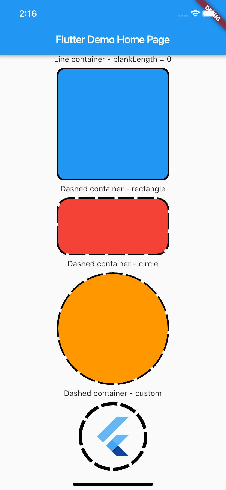

# dashed_container

A Dashed Container plugin for Flutter, easy to implement dashed line for your widgets

## Demo


## Usage
To use plugin, just import package `import 'package:dashed_container/dashed_container.dart';`

## Example
You can check example directory to know how to use it like the demo image.

```
    import 'package:flutter/material.dart';
    import 'package:dashed_container/dashed_container.dart';

    void main() => runApp(MyApp());

    class MyApp extends StatelessWidget {
      @override
      Widget build(BuildContext context) {
        return MaterialApp(
          title: 'Flutter Demo',
          theme: ThemeData(
            primarySwatch: Colors.blue,
          ),
          home: MyHomePage(title: 'Flutter Demo Home Page'),
        );
      }
    }

    class MyHomePage extends StatefulWidget {
      MyHomePage({Key key, this.title}) : super(key: key);

      final String title;

      @override
      _MyHomePageState createState() => _MyHomePageState();
    }

    class _MyHomePageState extends State<MyHomePage> {
      @override
      Widget build(BuildContext context) {
        return Scaffold(
          appBar: AppBar(title: Text(widget.title)),
          body: SingleChildScrollView(
            child: Center(
              child: Column(
                mainAxisSize: MainAxisSize.max,
                crossAxisAlignment: CrossAxisAlignment.center,
                mainAxisAlignment: MainAxisAlignment.center,
                children: <Widget>[
                  Text('Line container - blankLength = 0'),
                  _buildSpace(),
                  DashedContainer(
                    child: Container(
                      height: 200.0,
                      width: 200.0,
                      decoration: BoxDecoration(color: Colors.blue, borderRadius: BorderRadius.circular(10.0)),
                    ),
                    dashColor: Colors.black,
                    borderRadius: 10.0,
                    dashedLength: 30.0,
                    blankLength: 0.0,
                    strokeWidth: 6.0,
                  ),
                  _buildSpace(),
                  Text('Dashed container - rectangle'),
                  _buildSpace(),
                  DashedContainer(
                    child: Container(
                      height: 100.0,
                      width: 200.0,
                      decoration: BoxDecoration(color: Colors.red, borderRadius: BorderRadius.circular(20.0)),
                    ),
                    dashColor: Colors.black,
                    borderRadius: 20.0,
                    dashedLength: 30.0,
                    blankLength: 6.0,
                    strokeWidth: 6.0,
                  ),
                  _buildSpace(),
                  Text('Dashed container - circle'),
                  _buildSpace(),
                  DashedContainer(
                    child: Container(
                      height: 200.0,
                      width: 200.0,
                      decoration: BoxDecoration(color: Colors.orange, shape: BoxShape.circle),
                    ),
                    dashColor: Colors.black,
                    boxShape: BoxShape.circle,
                    dashedLength: 30.0,
                    blankLength: 6.0,
                    strokeWidth: 6.0,
                  ),
                  _buildSpace(),
                  Text('Dashed container - custom'),
                  _buildSpace(),
                  DashedContainer(
                    child: Padding(
                      padding: const EdgeInsets.all(20.0),
                      child: FlutterLogo(
                        size: 80,
                      ),
                    ),
                    dashColor: Colors.black,
                    boxShape: BoxShape.circle,
                    dashedLength: 30.0,
                    blankLength: 6.0,
                    strokeWidth: 6.0,
                  ),
                  _buildSpace(),
                ],
              ),
            ),
          ),
        );
      }

      Widget _buildSpace() {
        return SizedBox(height: 10.0);
      }
    }

```